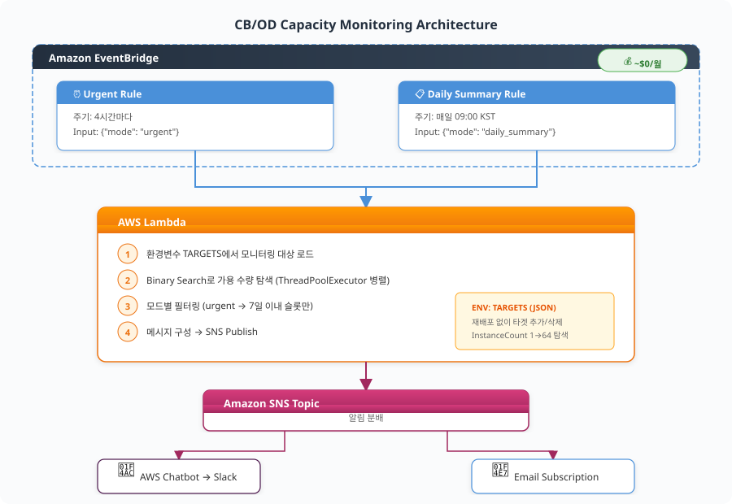

# EC2 Capacity Blocks 가용량 모니터링 시스템

GPU 인스턴스(P5, P5en, P6-B300, Trn2 등)의 Capacity Block 가용 슬롯을 자동 모니터링하고, 가용 슬롯 발생 시 즉시 Slack/이메일 알림을 받는 서버리스 시스템입니다.

## 아키텍처




```
EventBridge (4시간 간격)
    ↓
Lambda (Python 3.12)
  ├── DescribeCapacityBlockOfferings API 호출
  ├── Binary Search로 최대 가용 인스턴스 수 탐색
  └── 변화 감지 시 → SNS Publish
    ↓
SNS Topic
  ├── AWS Chatbot → Slack 채널
  └── Email 구독 (선택)

```

## 구성 요소

| 파일 | 설명 |
| --- | --- |
| `template.yaml` | CloudFormation 템플릿 (Lambda + EventBridge + IAM Role) |
| `architecture.svg` | 아키텍처 다이어그램 |

## 사전 준비

1. **SNS Topic** 생성 (알림 수신용)
2. **AWS Chatbot** 설정 → Slack 채널 연동 (선택)
3. **Bubble Tea** 설정 — 모니터링 전용 계정은 반드시 **값을 0으로** 설정해야 고객과 동일한 전체 오퍼링 뷰 제공- URL: [https://ec2-bubbletea.amazon.com/new](https://ec2-bubbletea.amazon.com/new)
- Request Type: `EC2CapacityBlockReservations`
- Number of Active Capacity Block Reservations: **0**

## 배포

```bash
aws cloudformation deploy \
  --template-file template.yaml \
  --stack-name gpu-cb-monitor \
  --parameter-overrides \
    SnsTopicArn=arn:aws:sns:<REGION>:<ACCOUNT_ID>:<TOPIC_NAME> \
    CheckIntervalMinutes=240 \
  --capabilities CAPABILITY_NAMED_IAM \
  --region ap-northeast-2

```

## 파라미터

| 파라미터 | 기본값 | 설명 |
| --- | --- | --- |
| `SnsTopicArn` | (필수) | 알림 수신할 SNS Topic ARN |
| `CheckIntervalMinutes` | 240 (4시간) | 체크 간격 (분) |

## 모니터링 대상 커스텀

`template.yaml` 내 Lambda 환경 변수에서 모니터링 대상 인스턴스/리전을 수정:

```yaml
Environment:
  Variables:
    TARGETS: >
      [
        {"instance_type": "p5en.48xlarge", "region": "ap-northeast-2"},
        {"instance_type": "trn2.48xlarge", "region": "us-east-2"}
      ]

```

## 비용

- Lambda: 4시간 간격 실행 → 월 ~180회 = **사실상 $0**
- EventBridge: 무료 티어
- SNS: 알림 건당 과금 (Slack 무료, Email 무료)
- **API 호출 자체**: 무료 (`DescribeCapacityBlockOfferings`는 과금 없음)

## 알림 예시

```
🟢 [CB Available] p5en.48xlarge @ ap-northeast-2
━━━━━━━━━━━━━━━━━━━━━━━━━━━━━━
가용 인스턴스: 2대
시작일: 2026-09-01
기간: 24h / 168h / 336h
━━━━━━━━━━━━━━━━━━━━━━━━━━━━━━

```

## 참고

- [DescribeCapacityBlockOfferings API 문서](https://docs.aws.amazon.com/AWSEC2/latest/APIReference/API_DescribeCapacityBlockOfferings.html)
- [Capacity Blocks for ML 공식 가이드](https://docs.aws.amazon.com/AWSEC2/latest/UserGuide/capacity-blocks-using.html)

